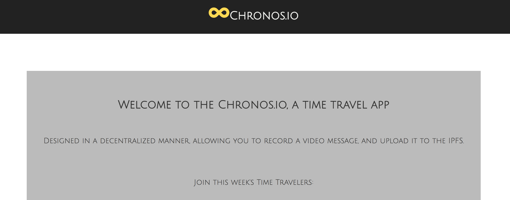

# Chronos.io



A distributed time travel app, where you can record video message and send it to the future.
* [Link to video demo](https://ipfs.io/ipfs/QmctXuva4qutFTyj4Q9N8tb4efXsVjQbeLwrdHF9nVHwU4)

## Getting Started

Fork it, clone it, run it.

### Installing

In client
```
npm install
npm start
```

In server folder
```
npm install
mongod
node or nodemon index.js
```

Have fun

## Built With Love and:

* [React](https://reactjs.org/) - Frontend Web Framework
* [Redux](https://redux.js.org/) - Clear state of mind
* [IPFS](https://ipfs.io/) - Inter Planetary File System to store videos forever
* [WebRTC](https://webrtc.org/) - RecordRTC library to record live streams from user's devices
* [Express](http://expressjs.com/) - Back end + runs CRON to send recordings
* [MongoDB](https://www.mongodb.com/) - Database to store user emails and IFPS hashes

## Running the tests

Yet to be written

## Deployment

Yet to be deployed

## Contributing & Issues

Please feel free to contribute or report issues/bugs.

## Authors

* **Nikitq Kudryqvtsev** - *Full Stack Architect* - [Palevoo](https://github.com/palevoo)

## License

This project is licensed under the MIT License - see the [LICENSE.md](LICENSE.md) file for details

## Future

* Create Ethereum smart contract to which you can send funds with hash of video location, which would only unfreeze in given period.
* Create an oracle on EVM (Ethereum Virtual Machine) to query smart contract (CRON)
* Improve UI (add clock, visuals and design)   
